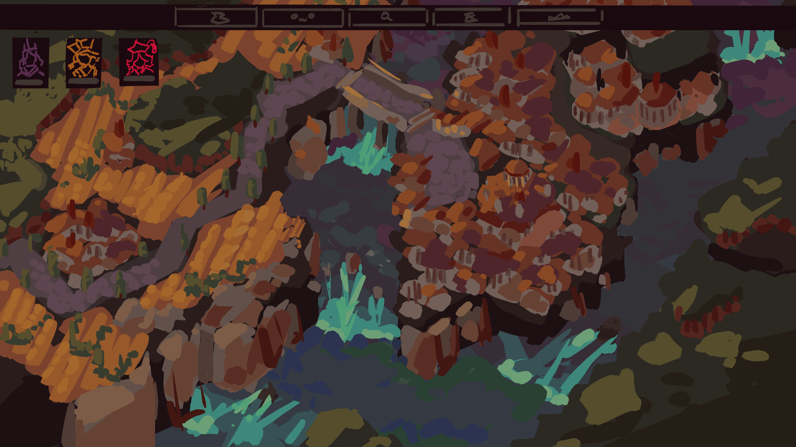
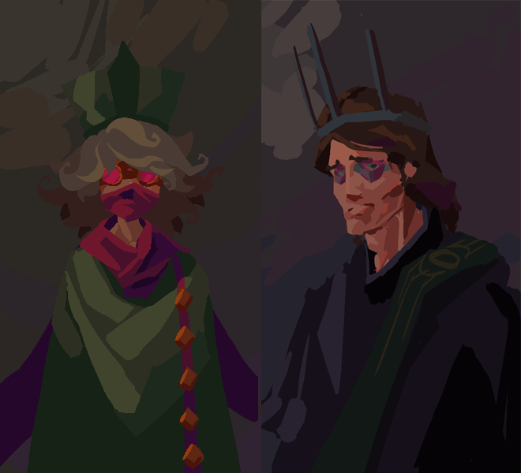

#### NorthernCity (early Prototype)
- Politics game

#### Engine
- Unity

#### Languages
- C#

#### Mechanics
- Everything is Divided into smaller Components and the User has the Ability to link them.

#### Characters
- The Player slips into a character rather then a state to control the people

